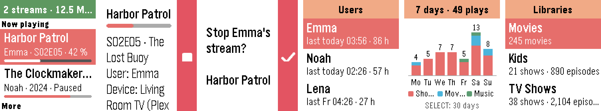

# Tautulli für Pebble

Deine [Tautulli](https://tautulli.com/)- bzw. Plex-Aktivität am Handgelenk.
Sieh, wer gerade was schaut, beende einen Stream mit einem Knopf und blättere durch
Verlauf, neue Medien, Nutzer, Bibliotheken und Statistiken – auf der Pebble Time 2.



*Screenshots von einer Pebble Time 2 im Demo-Modus mit erfundenen Daten.*

[English version](README.md) · [Änderungen](CHANGELOG.md) · [Mitmachen](CONTRIBUTING.md)

Wenn dir die App gefällt, freue ich mich über einen [Kaffee](https://buymeacoffee.com/michaelrunge) ☕ –
kostenlos und Open Source bleibt sie so oder so.

## Funktionen

- **Jetzt läuft** – aktuelle Streams mit Nutzer, Folge/Jahr und Fortschrittsbalken.
  Oben steht, ob Plex erreichbar ist, wie viele Streams laufen und die Gesamtbandbreite.
  Aktualisiert sich alle 30 Sekunden, solange die App offen ist. Fortschritt wahlweise in Prozent,
  als Restzeit („noch 14 Min“) oder als Uhrzeit des Endes („bis 21:45“).
- **Stream-Details** – Gerät, Zeit, Qualität (Direct Play / Transcode), Bandbreite, LAN/WAN.
- **Stream beenden** – roter Stopp-Knopf neben SELECT, mit Rückfrage.
  Der Zuschauer sieht „Der Stream wurde beendet.“ (braucht Plex Pass).
- **Verlauf** – zuletzt Geschautes mit Nutzer, Zeitpunkt und Fortschritt.
- **Neu hinzugefügt** – neue Filme, Folgen, Staffeln und Alben.
- **Nutzer** – wer zuletzt geschaut hat und wie viel. Mit SELECT die Ansicht dieser Person:
  Wiedergabezeit (heute / 7 / 30 Tage), eigenes Diagramm „Wiedergaben pro Tag“ und Verlauf.
- **Zu Ende geschaut** – die Uhr vibriert und zeigt „Emma hat Harbor Patrol S02E05 zu Ende geschaut“,
  wenn ein Stream mit mindestens 90 % endet (auch wenn per Autoplay die nächste Folge startet).
  Funktioniert, solange die App offen ist; für Benachrichtigungen bei geschlossener App siehe
  [Benachrichtigungen bei geschlossener App](#benachrichtigungen-bei-geschlossener-app-ntfy).
- **Statistik** – Wiedergabezeit heute / 7 / 30 Tage, Top-Nutzer, Top-Filme und -Serien.
- **Diagramm** – Wiedergaben pro Tag als gestapelte Balken (Serien, Filme, Musik), 7 oder 30 Tage.
- **Bibliotheken** – Anzahl Filme, Serien/Folgen, Künstler/Alben je Bibliothek.
- **Deutsch und Englisch** – Uhr, Meldungen und Einstellungsseite.
- **Demo-Modus** – mit `demo` als Adresse lässt sich die App ohne Server ausprobieren.

## Einrichtung

1. App auf die Uhr bringen (Pebble-Appstore, die `.pbw` aus dem
   [neuesten Release](../../releases/latest) oder selbst bauen, siehe unten).
2. In Tautulli den API-Key kopieren: *Settings → Web Interface → API*.
3. In der Pebble-App auf dem Handy **Tautulli → Einstellungen** öffnen und eintragen:
   - **Tautulli-Adresse**, z. B. `http://192.168.1.10:8181`
   - **API-Key**
   - optional **Sprache**, wie der **Fortschritt** angezeigt wird (Prozent, Restzeit, Ende um),
     ob die Uhr **vibrieren** soll, wenn etwas zu Ende geschaut ist,
     und wie viele Einträge die Listen zeigen

Die Uhr spricht nie direkt mit deinem Server, das macht das Handy. Mit einer lokalen
Adresse funktioniert die App deshalb nur, solange das Handy im Heim-WLAN ist.
Für unterwegs brauchst du eine von außen erreichbare Adresse (z. B. einen Reverse Proxy mit HTTPS).

## Benachrichtigungen bei geschlossener App (ntfy)

Eine Pebble-App läuft nur, solange sie auf der Uhr offen ist. Wenn die Uhr auch bei
geschlossener App vibrieren soll, wenn etwas zu Ende geschaut wurde, lässt du Tautulli
die Nachricht schicken – die Pebble zeigt ohnehin jede Benachrichtigung vom Handy an:

1. Auf dem Handy die App **ntfy** installieren und ein Thema mit schwer zu erratendem Namen
   abonnieren, z. B. `plex-michael-7f3k`. In der Pebble-App Benachrichtigungen von ntfy erlauben.
2. In Tautulli: *Settings → Notification Agents → Add a new notification agent → ntfy*.
   - **Configuration:** ntfy Host Address `https://ntfy.sh` (oder dein eigener ntfy-Server), ntfy Topic wie oben.
   - **Triggers:** **Watched** anhaken (optional auch *Playback Start* oder *Playback Stop*).
   - **Text:** z. B. Betreff `Plex`, Text `{user} hat {title} gesehen`.
3. Mit *Test Notifications* unten im Agenten ausprobieren.

Ab wann ein Stream als „gesehen“ zählt, stellst du in *Settings → General → Watched Percent* ein.

## Tasten

| Taste | Funktion |
|---|---|
| UP / DOWN | blättern |
| SELECT | öffnen |
| SELECT lang | neu laden |
| SELECT in Stream-Details | Stream beenden (mit Rückfrage) |
| SELECT im Diagramm | 7 ↔ 30 Tage |
| BACK | zurück |

## Selbst bauen

```bash
# Linux / macOS / Windows (WSL) – siehe https://developer.repebble.com/sdk/
uv tool install pebble-tool --python 3.13
pebble sdk install latest

pebble build
pebble install --emulator emery     # Emulator (Einstellungen: pebble emu-app-config)
pebble install --cloudpebble        # Uhr (Dev Connect in der Pebble-App einschalten)
```

Aufbau des Projekts und technische Details: siehe [README.md](README.md#how-it-works).

## Wie die App entstanden ist

Die App wurde mit Hilfe eines KI-Assistenten (Claude von Anthropic) entwickelt.
Geprüft, getestet und gepflegt wird sie von mir.

## Lizenz

[MIT](LICENSE) © 2026 Michael Runge.

Kein offizielles Projekt von Tautulli, Plex oder Core Devices.
